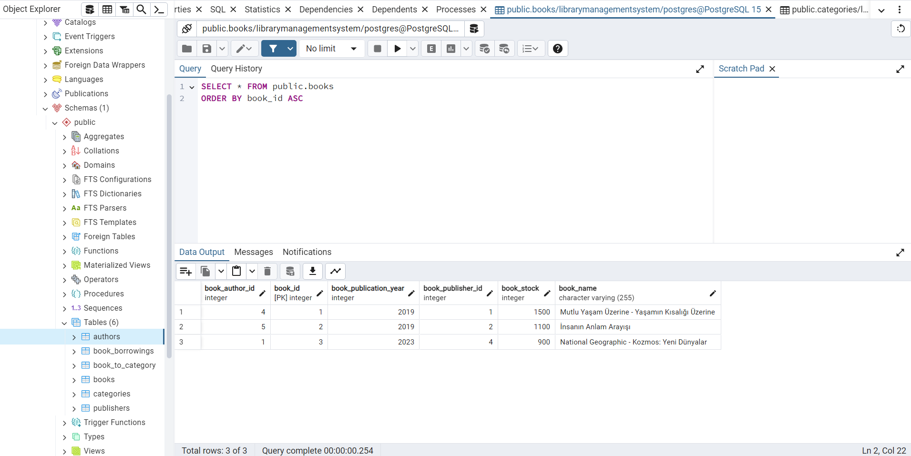
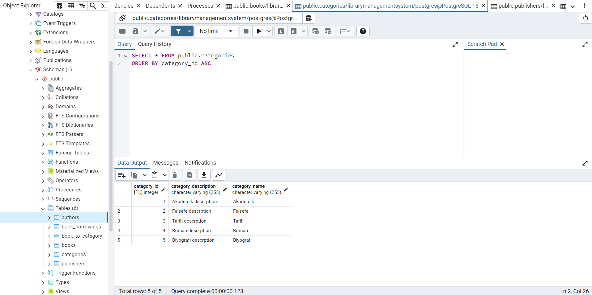
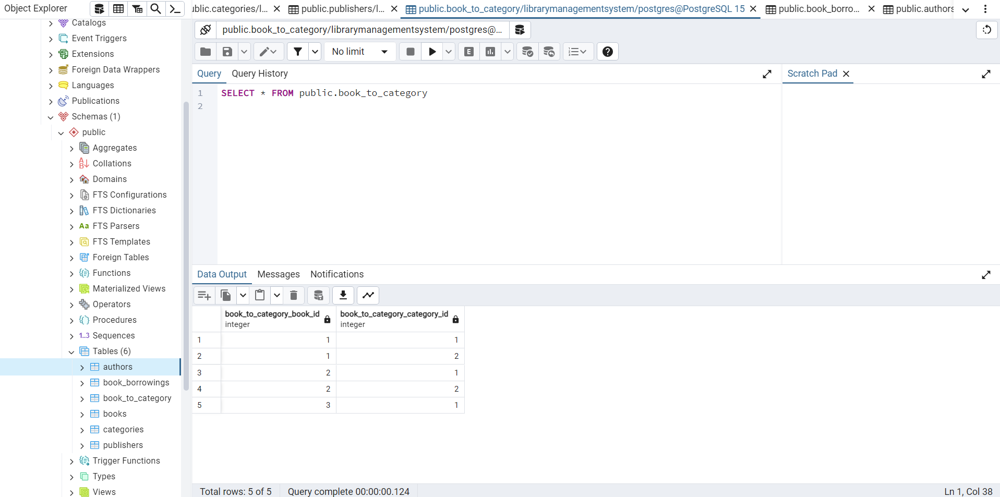
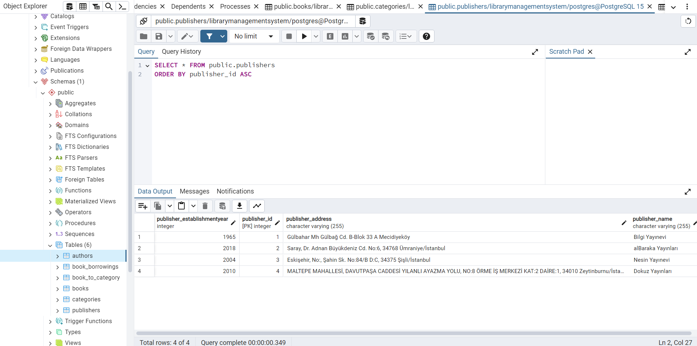
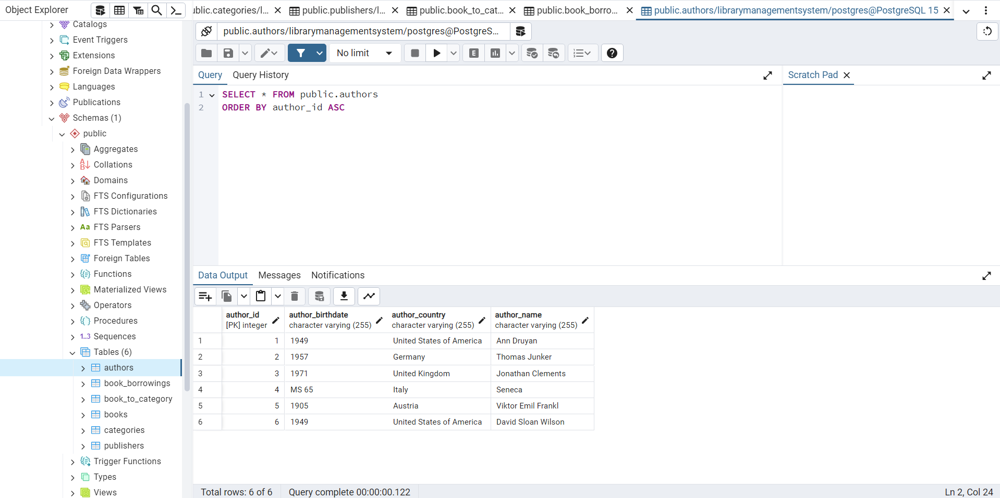
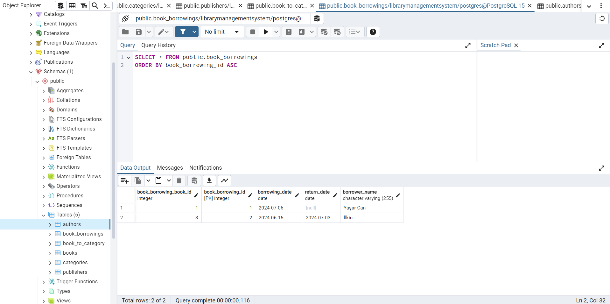

# Library Management System

This project is a library management system built using Java, Maven, JPA, and Hibernate for managing the entities such as books, authors, categories, publishers, and book borrowings. The system uses PostgreSQL as the database.

## Project Description

The Library Management System allows the management of books, authors, categories, publishers, and book borrowings. It supports creating, reading, updating, and deleting records for these entities, as well as managing the relationships between them.

## Technologies Used

- Java
- Maven
- JPA (Java Persistence API)
- Hibernate (as the JPA implementation)
- PostgreSQL (as the database)
- Jakarta Persistence (for annotations)

## Installation

1. **Clone the repository:**
    ```sh
    git clone https://github.com/yasarcandamli/LibraryManagementSystem.git
    ```

2. **Navigate to the project directory:**
    ```sh
    cd LibraryManagementSystem
    ```

3. **Update the database configuration:**
    - Open the `src/main/resources/META-INF/persistence.xml` file.
    - Update the database URL, username, and password according to your PostgreSQL configuration.

4. **Run the project using Maven:**
    ```sh
    mvn clean install
    mvn exec:java -Dexec.mainClass="dev.patika.Runner"
    ```

## Usage

The project defines several entities and their relationships:

- **Book:**
    - Fields: id, name, publicationYear, stock, author, categoryList, publisher, bookBorrowingList.
    - Relationships: Many-to-One with Author and Publisher, Many-to-Many with Category, One-to-Many with BookBorrowing.

- **Author:**
    - Fields: id, name, birthDate, country, bookList.
    - Relationships: One-to-Many with Book.

- **Category:**
    - Fields: id, name, description, bookList.
    - Relationships: Many-to-Many with Book.

- **Publisher:**
    - Fields: id, name, establishmentYear, address, bookList.
    - Relationships: One-to-Many with Book.

- **BookBorrowing:**
    - Fields: id, borrowerName, borrowingDate, returnDate, book.
    - Relationships: Many-to-One with Book.

### Example Data

The `Runner` class contains example data to be persisted to the database. When you run the project, this data will be inserted into the corresponding tables in the PostgreSQL database.

## Database Screenshots
### Books


### Categories


### Book to Category


### Publishers


### Authors


### Book Borrowings
